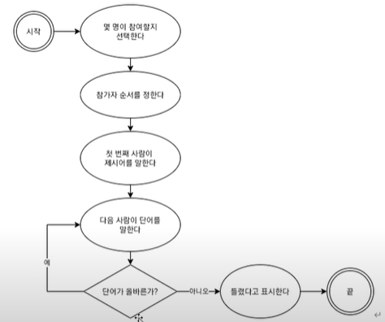

# 3강 자바스크립트 강좌

## 1. 순서도를 그리는 이유

- 프로그램은 고정된 절차로 돌아가야 한다.
- 모든 가능성을 고려해야 한다.

<번호스타일>

1. 게임에 몇 명이 참가할지를 선택한다.
2. 참가자 순서를 정한다(편의상 숫자로 한다)
3. 첫 번째 사람이 어떤 단어를 말한다.
4. 다음 사람이 어떤 단어를 말한다.
5. 절차 4에서 말한 단어가 올바른지 판단한다.
6. 올바르다면 그 다음 사람이 어떤 단어를 말한다.
7. 올바르지 않다면 틀렸다고 표시한다.
8. 게임을 계속 진행(절차4로 이동)한다.

</번호스타일>

- 순서도를 토대로 코드를 보완하고, 코드를 토대로 순서도를 체크한다(상호보완적).

<그림텍스트>



</그림텍스트>

## 2. 인터프리터와 컴파일

### 인터프리터

자바스크립트 코드를 콘솔에 입력하고 엔터키를 누르면 결과가 바로 나왔다(undefined가 그 결과). 이처럼 코드를 한 덩어리씩 실행해 결과를 출력하는 방식을 **인터프리터** 방식이라고 한다.

한 덩어리라고 표현한 이유는 **Shift+Enter** 키를 누르면 줄바꿈을 해 여러 줄의 코드를 동시에 입력할 수 있기 때문이다.

### 컴파일

자바스크립트와는 반대로 코드를 컴퓨터가 이해할 수 있는 언어로 변환하는 과정을 거친 후 한 번에 실행하는 방식을 **컴파일** 방식이라고 한다. C나 C++, 자바 등의 언어에서 이 방식을 사용한다.

### REPL

브라우저의 콘솔은 코드를 한 줄씩 입력받고(Read), 받은 입력을 평가(Eval)한 후, 결과를 출력(Print)한다. 그 후, 다시 프롬프트가 나타나 새로운 입력을 기다린다(Loop). 이러한 특성때문에 콘솔을 **REPL**이라고 한다.

## 3. prompt, alert, confirm

### prompt

- 사용자가 입력한 데이터를 받는다.

### alert

- 사용자에게 경고메세지를 보여준다.

### confirm

- 사용자의 예/아니오 확인 메세지를 받는다.

## 4. 자식 및 자손 태그

```html
<div>
    <span>
    	<p>
        </p>
    </span>
</div>

// div태그의 자식 태그인 span
const $span = document.querySelector('div>span')
// div태그의 자손 태그인 span
const $span = document.querySelector('div span')
```

### <코드>사용법

```html
document.querySelector('선택자 내부선택자 내부선택자...')
// body #target button 등 가능
```

